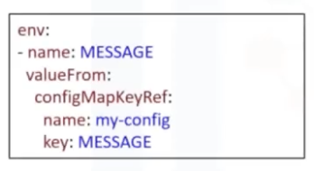

# Learn Kubernetes

# Sumário

# 1 - Kubernetes Archtecture

- A deployment of kubernetes is called **Cluster**

## a) Kubernetes Components

### **Control Plane:** 
...what makes decision aboute the cluster and detects and responds to events in the cluster
- Consists on:
    1. **Kuberenetes API Server:** kube-api-server
        - All communications in the cluster utilizes this API, receiveing commands to, for example, view or change the state of the cluster.
    2. **etcd**:
        - Highly available key-value store
        - Containes all the cluster data, like configurations of the cluster
        - Is the source of truth for the state in a Kubernetes Cluster
    3. **Kubernetes Scheduler:** kube-scheduler
        - Assigns newly created **Pods** to **Nodes**
        - Determines where workload should run in the Cluster
    4. **4. Kubernetes Controller Manager:** kube-controller-manager
        - Runs all the **Controller** processes that monitors the cluster state and ***ensure that the actual state of a cluster matches the desired state***
    5. **Cloud Controller Manager:** Runs Controllers that interact with underlying cloud providers and link the clusters into its apis (cloud agnostic). It enables to both K8 and cloud providers to evolve freely without introducing dependecies on the other.
- ex:
    1. Scheduling of workloads
    2. Create resources when an application is deployed

### **Worker Nodes**
...worker machines in a kubernetes clustrer. User applications are run on nodes.
- Managed by the control plane and able to run Pods
- Not created by the kubernetes itself, but by the cloud provider, enabling kubernetes to run on a variety of infraestructure.
- The componentes on a Node, enable that node to run Pods:
    1. **Kubelete:** Communicaates with the K8s API server to receive new and modified Pod specifications and ensure that those Pods and their associated containers are running as desired. It also reports to the control plane on health and status. To start Pods, the kubelete uses the container Runtime, which is responsible for downloading images and running containers. Kubernetes permits pluggability of the container runtime (you can use other than docker).
    2. **Kubernetes Proxy:** is a network proxy that runs on each node in a cluster.
        - Mantain rules that allow communication to Pods, inside or outside a cluster.

### Diagram:


## b) Kubernetes Objects
- Persistent objects in kubernetes, unless modified or removed;
- They define the state of the cluster;
- ex: Pods, namespaces, deployments, ConfigMaps and volumes;
`$ kubectl` -> is used to create, update or delete objects through k8`s api in the terminal;
 - They consists of two main field:
    1. spec: dictates the desired state;
    2. status: provided by Kubernetes; Describes the actual state as opposed to its desired state;4
    - The goal is for the desired state to match the current state;

1. Namespace: provides a way to virtualize a physical cluster;
    - Make one cluster appear to be several distinct cluster;
    - Usefull if several teams want to share a cluster;
    - Clusters will automatically have several namespaces created that are used to house elements of k8s architecture;
    - Users should not put applications to namespaces, instead, there might be a default namespace which can be used to hold the users` application;
    - Can provide logical separation of a cluster;
    - They provide a scope for the names of objects -> each object has a name -> each name is unique for that resource type within that namespace (Pods can`t have the same name if in the same namespace);

2. Labels: provides attributes to an object without specifying any uniqueness
    - Key/value pairs that can be attached to objects in order to identify those objects;
    - Enables Objects to be grouped and organized
    - Selectors: core grouping primitive in k8s
        - Enables to identify a set of objects

## c) Kube CLI
- 2 types of commands:
    1. Imperative: Kubernetes objects CRUD
        - ex: '''kubectl run nginx --image nginx'''
    2. Declarative: allow to use tamplates
        - These tamplates are called: Imperative object configuratioin
            - They define one or more object
            - No operation is specified, needed operations are inferred by kubectl
        - Commands: Create, Replace or Delete
        - Preferred method for production
    - The first one works better on files whereas the last, on directories.

## d) Using Kubernetes:
- **Apply** command: main command - it requires a file or directories of files
    - when the command is run, the state of the targeted kubernetes cluster is made to match the state that's defined int the provided files
        - the desired state is all that's required and kubectl will determine the specific actions to take
        - ex: kubectl apply -f file.yaml
- **Get** command: lists on or more resources
- **Describe** command: shows details about a specific resource or of a group of resources
- Get and Describe are namespace-scope, meaning that by default they will operate on the resources in the targeted namespace
    - both get and describe will list and describe all the resources on the namespace
- Kube-system is a namespace for objects created by kubernetes that it's not a user-created namespace
- **Config** command:
    - kubectl config get-clusters: lists kubernetes clusters configured
    - kubectl config get-contexts: lists group of access parameters, including a cluster, a user, and a namespace
    - kubectl get pods: list all the Pods in your namespace

### 1. Creating a POD Imperatively:
1. Export your namespace as an environment variable so that it can be used in subsequent commands:
    - ```export MY_NAMESPACE=sn-labs-$USERNAME```
2. Building Docker Image with DockerFile:
    - ```docker build -t us.icr.io/$MY_NAMESPACE/hello-world:1 . && docker push us.icr.io/$MY_NAMESPACE/hello-world:1```
3. Testing our image as a container with kubernetes:
    - ```kubectl run hello-world --image us.icr.io/$MY_NAMESPACE/hello-world:1 --overrides='{"spec":{"template":{"spec":{"imagePullSecrets":[{"name":"icr"}]}}}}'```
    - The --overrides option here enables us to specify the needed credentials to pull this image from IBM Cloud Container Registry. Note that this is an imperative command, as we told Kubernetes explicitly what to do: run hello-world.
4. List the Pods in your namespace:
    - ```kubectl get pods```
    - An auto-generated name was given to this Pod.
5. Specify the wide option for the output to get more details about the resource:
    - ```kubectl get pods -o wide```
6. Describe the Pod to get more details about it:
    - ```kubectl describe pod hello-world```
    - Note: The output shows the pod parameters like Namespace, Pod Name, IP address, the time when the pod started running and also the container parameters like container ID, image name & ID, running status and the memory/CPU limits.
7. Delete the Pod.
    - ```kubectl delete pod hello-world```
8. Listing again to verify deletion
 - ```kubectl get pods```

 ### 2. Create a Pod with Imperative object configuration
 Imperative object configuration lets you create objects by specifying the action to take (e.g., create, update, delete) while using a configuration file.

 - example of file in ./intro/hello-world-create.yaml
 1. Imperatively create a Pod using the provided configuration file.
    - ```kubectl create -f hello-world-create.yaml```
2. List the Pods in your namespace:
    - ```kubectl get pods```
3. Delete the Pod:
    - ```kubectl delete pod hello-world```
4. Check deletion:
    - ```kubectl get pods```

### 3. Create a Pod with a declarative command
While the imperative commands are easy to understand and run, they are not ideal for a production environment. Let’s look at declarative commands.
 
 - example of file in ./intro/hello-world-apply.yaml

1. Use the kubectl apply command to set this configuration as the desired state in Kubernetes:
    - ```kubectl apply -f hello-world-apply.yaml```
2. Get the Deployments to ensure that a Deployment was created:
    - ```kubectl get deployments```
3. List the Pods to ensure that three replicas exist:
    - ```kubectl get pods```
    - With declarative management, we did not tell Kubernetes which actions to perform. Instead, kubectl inferred that this Deployment needed to be created. If you delete a Pod now, a new one will be created in its place to maintain three replicas.
4. Note one of the Pod names from the previous step, replace the pod_name in the following command with the pod name that you noted and delete that Pod and list the pods. To see one pod being terminated, there by having just 2 pods, we will follow the delete, immediately with get.
    - ```kubectl delete pod <pod_name> && kubectl get pods```

### 4. Load balancing the application
Since there are three replicas of this application deployed in the cluster, Kubernetes will load balance requests across these three instances. Let’s expose our application to the internet and see how Kubernetes load balances requests.

1. In order to access the application, we have to expose it to the internet using a Kubernetes Service:
    - ```kubectl expose deployment/hello-world```
    - This command creates what is called a ClusterIP Service. This creates an IP address that accessible within the cluster.
2. List Services in order to see that this service was created:
    - ```kubectl get services```
3. Open a new terminal window using Terminal > Split Terminal:
4. Since the cluster IP is not accessible outside of the cluster, we need to create a proxy. Note that this is not how you would make an application externally accessible in a production scenario. Run this command in the new terminal window since your environment variables need to be accessible in the original window for subsequent commands.
    - ```kubectl proxy```
    - This command doesn’t terminate until you terminate it. Keep it running so that you can continue to access your app.
5. In the original terminal window, ping the application to get a response:
    - ```curl -L localhost:8001/api/v1/namespaces/sn-labs-$USERNAME/services/hello-world/proxy```
6. Run the command which runs a for loop ten times creating 10 different pods and note names for each new pod:
    - ```for i in `seq 10`; do curl -L localhost:8001/api/v1/namespaces/sn-labs-$USERNAME/services/hello-world/proxy; done```
    - You should see more than one Pod name, and quite possibly all three Pod names, in the output. This is because Kubernetes load balances the requests across the three replicas, so each request could hit a different instance of our application.
7. Delete the Deployment and Service. This can be done in a single command by using slashes:
    - ```kubectl delete deployment/hello-world service/hello-world```
8. Return to the terminal window running the proxy command and kill it using Ctrl+C.


# 2. Managing Applications with Kubernetes

ReplicaSets, autoscaling, rolling updates, ConfigMaps, secrets, and service bindings.


## 1. ReplicaSets:

- Allows redudancy on application. It's created automatically when a deployment is created.
- Help us scale applications to meet increasing demand.
- It manages your pods ensuring the right number of pods are always up and running.
- Replicate, resstart or spin new pods when existing one fail.
- A ReplicaSet can pick an existing pod to add to the deployment or create a new one if there are no existing pods.
- The ReplicaSet does not own any of the pods; instead it uses the pod labels to decide which pods to acquire when bringing a deployment to the desired state. The template metadata inside the YAML spec defines the labels of potential pod candidates to add or delete.
- A ReplicaSet will be always automatically created when a deployment is created
- To create one from scratch, you can simply apply a YAML file with the "kind" attribute set to “ReplicaSet”
- While it's possible to create a ReplicaSet without a deployment, it's recommended that you create a deployment instead. A deployment gives you a couple of additional features
- If you already have a deployment that you want to scale, you can simply use the “scale”:
    1. Create deployment:
        - ```kubectl create -f deployment.yaml```
    2. Getting number of pods:
        - ```kubectl get pods```
    3. Getting deployment infos:
        - ```kubectl get deploy```
    4. Scalling:
        - ```kubectl scale deploy hello-kubernetes --replicas=3```
    5. Checking if it worked:
        - ```kubectl get pods```
    6. Cheking if the replicaset is working:
        - Must delete one pod, so that the replicaset might create a new one in its place

## 2. Autoscalling:

- Autoscalling instead of providing a fixed number.
- **Horizontal Pod Autoscaler**, or HPA, enables the application to increase the number of pods based on traffic.
- You can configure the desired state in HPA (for example, the CPU and memory).
- The **master node** will periodically check pod metrics and scale to meet the desired state by updating the replicas field of the scaled resource, such as ReplicaSets or deployment.
1. If a deployment is running with a pod... you'll a pod and a replicaset
2. Autoscalling:
    - ```kubectl autoscale deploy hello-kubernetes --min=2 --max=5 --cpu-percent=10```
    - "min" is the minimum number of pods
    - "max" is the maximum number of pods
    - "cpu-percent" is the trigger to create new pods - This tells the system, “If the CPU usage hits 10% across the cluster, create a new pod
- Behind the scenes, the deployment is still using the ReplicaSet to scale up and down, creating a new one (one from the deployment and another from the autoscalling command)
- As noted before, a Horizontal Pod Autoscaler is created behind the scenes to manage the autoscaling feature of the deployment.
    - The other way to enable autoscaling for your application is to manually create a **HorizontalPodAutoscaler** kind of object as described in the YAML file.
    - 

## 3. Rolling Updates

- Publish updates or changes to a running application without noticeable interruptions for the user.
- Way to roll back any changes so the application can revert to a stable state in the event of errors.
- These are essential to any application running on a Kubernetes production environment.
- Rolling updates provide a way to roll out app changes in an automated and controlled fashion throughout your pods.
- Rolling updates work with pod templates such as deployments.
- Rolling updates allow for rollback if something goes wrong.
- How:
    1. Add **liveness** and **readiness** probes to your deployments.
        - This ensures deployments are marked "ready" appropriately.
        - 
    2. Next, add a rolling update strategy to your YAML file.
        - 
        - Here, we are creating a deployment with 10 pods and our strategy states that we want at least 50% of the pods to always be available.
        - The maxSurge of "2" says that there can only be 2 additional pods to the 10 we defined previously in order to finish the rollout.
        - You can also set the maxUnavailable to "0" for a zero-downtime system.
        - Setting the maxSurge to "100%" would essentially mean doubling the number of pods and creating a complete replica before taking the original set down after the rollout is complete.
        - Sometimes it's also useful to use the minReadySeconds attribute to wait a certain number of seconds before moving on to the next pod in the rollout stage.
    3. Making a change like changing the docker image of the cluster
        - ```kubectl set image deployments/hello-kubernetes hello-kubernetes=upkar/hello-kubernetes:2.0```
    4. Check the status:
        - ```kubectl rollout status deployments/hello-kubernetes```
    5. Check if the changes were made in the description of the pod:
        - ```kubectl describe pods```
- RollBack:
    1. ```kubectl rollout undo deployments/hello-kubernetes```
    2. check:
        - ```kubectl get pods```
        - ```kubectl describe pods```

## 3. Storying configuration
It’s a good practice not to hard-code configuration variables in code.
We keep them separate so that any changes in configuration do not require code changes.
Examples of these variables can include non-sensitive information like environments (for example, dev, test, and prod) or sensitive information such as API keys and account IDs.
The ConfigMap and the Secret are applied to the pod or the deployment just before they are run.

### 3.1. Config Maps
- ConfigMaps give us a way to provide configuration data to pods and deployments so we don't have to hard-code that data in the application code.
- You can also reuse these ConfigMaps and Secrets for multiple deployments, thereby decoupling the environment from the deployments themselves!
- ConfigMaps can be created in a couple of different ways:
    - Using string literals
    - Using an existing properties or ”key”=“value” file
    - Providing a ConfigMap YAML descriptor file;
- The deployment or pods can then consume a ConfigMap by using environment variables with the "configMapKeyRef" attribute or mounting a file using the volumes plugin.
- We can potentially supply the environment variable directly in the YAML file, as shown here:
    - 
    - The MESSAGE variable can now be used in the JavaScript file as "process.env.MESSAGE", but now the string “Hello from the config file” is hard-coded to our deployment in the descriptor file.
- Using a ConfigMap:
    1. provide a ConfigMap is to provide a key-value pair in the "create configmap" command.
        - ```kubectl create configmap my-config --from-literal=MESSAGE="hello from first configmap" configmap/my-config-created```
    2. Next, you need to tell your deployment about this new variable and where to pick it up:
        - Add an "env" section in the deployment descriptor, as shown here, and using the “valueFrom” attribute to point to the ConfigMap created in the first step.
        - 
        - In this case, the deployment will look for a key called "MESSAGE" in the ConfigMap named “my-config”.
- Listing all the configmaps:
    - ```kubectl get configmaps```
- Descripting the configmap:
    - ```kubectl describe configmap my-config```
- Adding a config map from a file:
    1. Create file:
        - ```cat my.properties``` --> MESSAGE=hello from testing
    2. Create configmap:
        - ```k create cm my-config --from-file=my.propeties```
    3. Tell deployment about the variables:
        - 
    - This file is useful for adding a large number of variables at the same time instead of listing them on the command line.
    - Notice that the deployment descriptor section also looks a little different. The key is now “my.properties” and everything inside the file will appear as subkeys in the environment variable.
    - To use it in the server.js file, you would refer to it as “process.env.MESSAGE.MESSAGE”.
    - If you give a directory to the “--from-file” flag, all files in the directory will be loaded into the Secret ConfigMap.
        - you can describe the deployment descriptor to get the YAML output as shown here.
        - In our case, we have saved the output from ”kubectl get configmap” as a YAML file called “my-config.yaml”.
        - 
        - Then we apply to our cluster:
            - 

    - You can also load the file under a specific key by using the “--from-file=key=filename” format.
### 3.2. Secrets
- Secrets work similarly to ConfigMaps but are meant for sensitive information.
- Creating:
    1. create a Secret using a string literal:
        - ```kubectl create secret generic api-creds --from-literal=key=mysupersecretapikey```
    2. Check:
        - ```kubectl get secret```
        - ```kubectl describe secret api-creds```
        - It won't be printed in plain text in the cli
        - ```kubectl get secret api-creds -o yaml```
            - it'll print the secret in yaml format and it'll show it encoded
    3. Using it:
        - Add a env to the deployment descriptor
        - 
        - Use it on API
- Creating with **volume mounts**:
    1. Create secret:
        - ```kubectl create secret generic api-creds --from-literal=key=mysupersecretapikey```
    2. In the descriptor YAML file, we need to have a volume for the Secret with a corresponding volume mount:
        -  
        - Each container in the descriptor file will have its own volume mount but can share the volume itself.
        - In this case, our "api-creds" Secret will be mounted as a file at "/etc/api/api-creds".
        - The program that needs this Secret will have to read and process the file to extract the Secret.

## 4. Service Binding:
- How to consume external services in our applications.
- One way to do that in Kubernetes is to bind the external service to our deployment.
- The service credentials are available as Secrets to any application deployed on the cluster.
1. Creating cloud service:
    -```ibmcloud resource service-instance-create upkar-tone-analyzer standard us-south```
2. Binding this newly created service to our cluster by using the ”service bind” command:
    - ```ibmcloud ks cluster service bind --cluster upkar_cluster --namespace default --service upkar-tone-analyzer```
3. By mounting the Kubernetes Secret as a volume to your deployment, you make the IBM Cloud Identity and Access Management (IAM) API key available to the container that runs in your pod.
    - Getting secrets:
        - ```kubectl get secrets --namespace=default```
    - 
4. A JSON file called "binding" is created in the volume mount directory.
5. The code will then use the credentials form the binding and call the Tone Analyzer service.
    - 


# 3. K8s Ecosistem

- Kubernetes isn’t an all-inclusive platform as a service that provides a lot of services out of the box.
- Instead, a decision was made to facilitate developer choice and provide a more flexible model, rather than a more opinionated one.

## Cloud ecosystem
- [Cloud Native Trail Map](https://landscape.cncf.io/):
    - which provides an overview for enterprises starting their cloud native journey.
    - 
        - Step 3 is the only step that includes Kubernetes as a solution.

## OpenShift:

### Builds:
- Is simply the process of transforming inputs into a resultant object.
- The input could be source code in a git repository, while the result wouldbe a container image.
- Build configuration:
    - A build configuration, or BuildConfig, is an OpenShift-specific object that defines the process for a build to follow.
    - OpenShift builds can automate the build process that we performed in our earlier modules.
    - Given a repository that contains a Dockerfile and the necessary artifacts, OpenShift invokes the “docker build“ command to create an image, just as we did from the command line.
    - In OpenShift, this strategy is simply called "Docker."
- "Source-to-image" is another build strategy offered by OpenShift.
    - Is a tool for building reproducible container images.
    - The new image is built by incorporating a builder image and the source.
- Custom Build:
    - Here, you must define a builder image that will be used for the build process, rather than relying on a builder image provided by OpenShift.
    - Both the Docker and s2i strategies result in runnable images, but the custom build strategy can be used to create any resulting objects. These can be .jar files or Python packages, for example.
### Triggers
### Istio